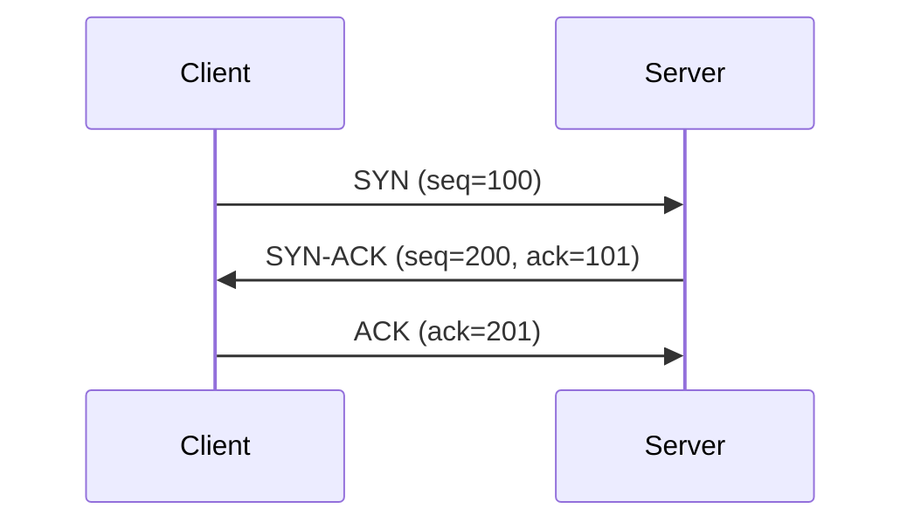

# TCP Communication: 3-Way Handshake

The **TCP 3-Way Handshake** is a process used to **establish a reliable TCP connection** between a client and a server. It ensures both sides are ready to send and receive data, and that sequence numbers are synchronized.

---

## Steps of the Handshake

1. **SYN (Synchronize) – Client → Server**

   * The client initiates the connection.
   * Sends a **SYN packet** to the server with an initial sequence number.
   * Purpose: “I want to connect. Here is my sequence number.”

2. **SYN-ACK (Synchronize + Acknowledge) – Server → Client**

   * The server receives the SYN and responds with:

     * **SYN**: Its own sequence number.
     * **ACK**: Acknowledgment of the client’s sequence number.
   * Purpose: “I received your request and here’s my sequence number.”

3. **ACK (Acknowledge) – Client → Server**

   * The client sends an **ACK packet** back to the server, acknowledging the server’s sequence number.
   * Purpose: “I received your sequence number, connection established.”

---

## Quick Diagram

---

## Key Points

* Establishes a **reliable, synchronized connection** before data transfer.
* Prevents data from being lost or arriving out of order.
* Only used by **TCP** (connection-oriented), not UDP (connectionless).

> **Analogy:**
> Think of it like a polite phone introduction:
>
> 1. Client: “Hi, can we talk?”
> 2. Server: “Yes, let’s talk, I’m ready.”
> 3. Client: “Great, I’m ready too.”